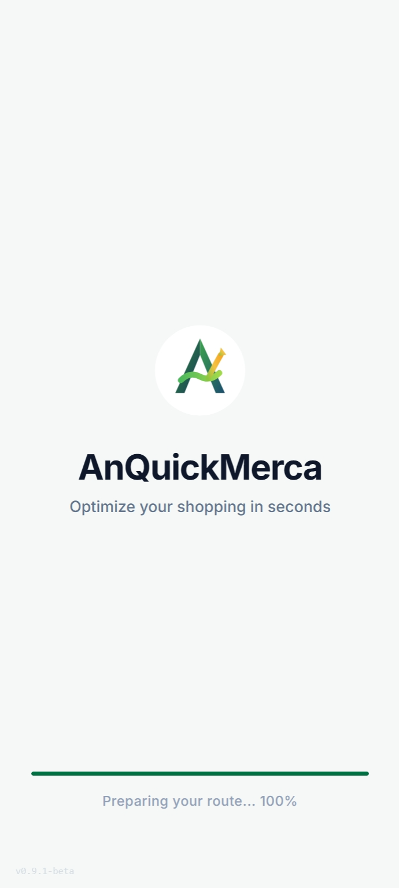
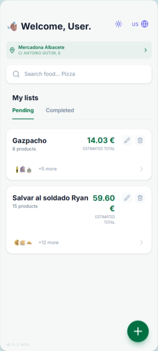
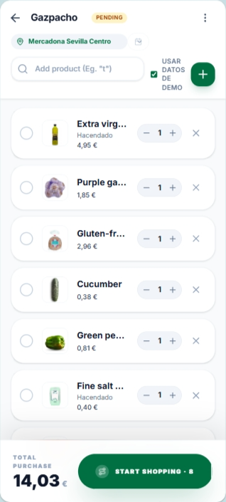
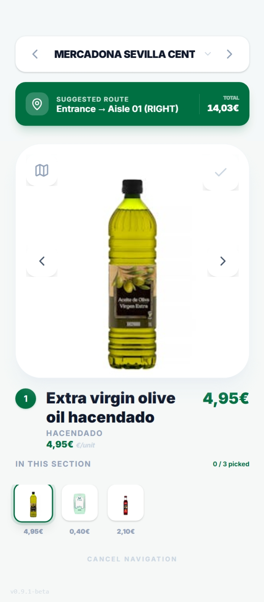

<div align="center">
  

# AnQuickMerca

**Optimize your shopping in seconds**

[](./LICENSE)
[](./public/manifest.json)


<p align="center">
  
  
  
  
</p>
</div>

🌐 https://anquickmerca-frontend.onrender.com

## What is AnQuickMerca?

AnQuickMerca is a **Progressive Web App (PWA)** built to optimize your Mercadona shopping in real time. Create smart shopping lists, get an efficient in-store route, and search products with AI assistance.

## Key Features

- 🛒 **Shopping lists** — Create, edit, and organize multiple lists
- 🗺️ **In-store navigation** — Optimized aisle routes to reduce time and backtracking
- 🔍 **AI-assisted search** — Find products using Google Gemini assistance
- 🌍 **Store picker** — Interactive Spain map with Mercadona locations
- 📱 **Installable PWA** — Works offline and feels like a native app on mobile
- 🌐 **Bilingual UI** — Full interface in Spanish and English
- 🔁 **Recurring lists** — Schedule daily, weekly, monthly, or yearly shopping
- 💰 **Estimated total** — Real-time cost estimate as you build your list

## Tech Stack

| Technology             | Purpose                          |
| ---------------------- | -------------------------------- |
| React 19 + TypeScript  | Frontend framework               |
| Vite 6                 | Build tool & dev server          |
| Tailwind CSS 4         | Styling & UI layout              |
| Motion (Framer Motion) | Animations                       |
| Lucide React           | Icons                            |
| Google Gemini AI       | Intelligent product search       |
| amCharts 5             | Interactive Spain map            |
| PWA (Web App Manifest) | Installability & offline support |

## Installation & Development

```bash
# Clone the repository
git clone https://github.com/nicolasar/AnQuickMerca.git
cd AnQuickMerca

# Install dependencies
npm install

# Set up environment variables
cp .env.example .env.local
# Edit .env.local and add your GEMINI_API_KEY

# Start the development server
npm run dev
# Open http://localhost:3000
```

## Environment Variables

| Variable         | Description                              | Required |
| ---------------- | ---------------------------------------- | -------- |
| `GEMINI_API_KEY` | Google Gemini API key for product search | Yes      |

## Available Scripts

```bash
npm run dev      # Start dev server on port 3000
npm run build    # Production build
npm run preview  # Preview the production build
npm run lint     # TypeScript checks (and linting if configured)
```

## Project Structure

```text
AnQuickMerca/
├── src/
│   ├── components/     # Reusable UI (modals, map, search)
│   ├── context/        # Global state via React Context
│   ├── hooks/          # Custom hooks (useTranslation, usePanZoom)
│   ├── i18n/           # Internationalization (ES/EN)
│   ├── screens/        # App screens
│   ├── utils/          # Utilities (logger)
│   ├── data/           # Store layout/map data
│   └── types.ts        # TypeScript type definitions
├── public/
│   ├── data/           # Product data (Algolia mocks) + Spain GeoJSON
│   └── manifest.json   # PWA configuration
└── .github/            # Issue/PR templates and CI/CD
```

## Contributing

1. Fork the repo
2. Create a feature branch: `git checkout -b feature/amazing-feature`
3. Commit your changes: `git commit -m "feat: add amazing feature"`
4. Push the branch: `git push origin feature/amazing-feature`
5. Open a Pull Request using the template

### Commit Conventions

We follow [Conventional Commits](https://www.conventionalcommits.org/):

- `feat:` — New functionality
- `fix:` — Bug fix
- `docs:` — Documentation updates
- `style:` — Formatting/UI-only changes (no logic)
- `refactor:` — Refactoring without behavior change
- `chore:` — Maintenance tasks

### Idea


---

<div align="center">
  Made with ❤️ by AnAppWiLos

</div>
